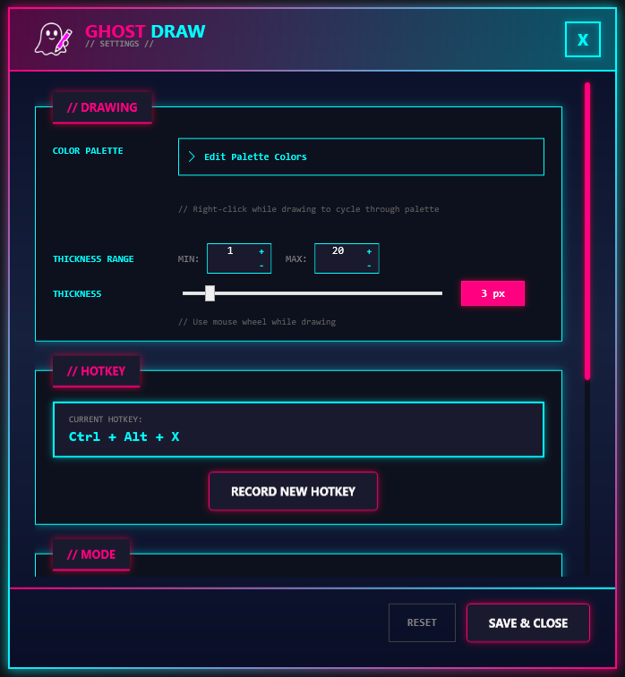

<div align="center">

# ?? GhostDraw

### Draw on Your Screen, Anywhere, Anytime

[](https://dotnet.microsoft.com/)
[](https://www.microsoft.com/windows)
[](LICENSE)
[](https://github.com/RuntimeRascal/ghost-draw/releases)

**GhostDraw** is a lightweight, cyberpunk-themed Windows desktop application that lets you draw directly on your screen with a simple keyboard hotkey. Perfect for presentations, tutorials, collaboration, or just having fun!

[**Download Latest Release**](https://github.com/RuntimeRascal/ghost-draw/releases) | [**Report Bug**](https://github.com/RuntimeRascal/ghost-draw/issues) | [**Request Feature**](https://github.com/RuntimeRascal/ghost-draw/issues)


<!-- TODO: Add animated GIF showing drawing on screen -->

</div>

---

## ? Features

### ?? **Drawing Tools**
- **Customizable Color Palette** - Create your own color collection and cycle through them while drawing
- **Variable Brush Thickness** - Adjust brush size from 1-100px with configurable min/max ranges
- **Smooth Drawing** - High-performance rendering for fluid strokes
- **Mouse Wheel Control** - Change brush thickness on-the-fly while drawing

### ?? **Hotkey System**
- **Global Hotkey** - Activate drawing mode from any application
- **Customizable Shortcuts** - Define your own key combinations
- **Two Draw Modes**:
  - **Toggle Mode** - Press once to start, press again to stop
  - **Hold Mode** - Draw only while holding the hotkey

### ?? **User Experience**
- **Transparent Overlay** - Draw on top of any application without blocking input
- **System Tray Integration** - Runs quietly in the background
- **Emergency Exit** - Press `ESC` to instantly hide the overlay
- **Right-Click Color Cycling** - Quickly switch between your palette colors
- **Position-Numbered Palette** - Easily organize and reorder your favorite colors

### ??? **Safety & Stability**
- **Fail-Safe Design** - Won't lock you out of your system if it crashes
- **Fast Input Processing** - All hooks complete in < 5ms for responsive system
- **Graceful Error Handling** - Protected critical paths ensure stability
- **Proper Resource Cleanup** - Memory and hooks always released properly

---

## ?? Screenshots

### Settings Window


Customize every aspect of GhostDraw with the intuitive settings panel:
- Color palette management with add/remove/reorder
- Brush thickness range configuration
- Hotkey customization
- Drawing mode selection
- Logging level control

### Active Drawing Mode

<!-- TODO: Add screenshot of drawing overlay in action with colored strokes -->

### Color Palette Cycling

<!-- TODO: Add screenshot showing color palette with active color indicator -->

### System Tray Integration

<!-- TODO: Add screenshot of system tray icon and context menu -->

---

## ?? Getting Started

### Requirements

- **Operating System**: Windows 10 or later
- **.NET Runtime**: [.NET 8 Desktop Runtime](https://dotnet.microsoft.com/download/dotnet/8.0) (automatically included in releases)

### Installation

1. **Download** the latest release from the [Releases page](https://github.com/RuntimeRascal/ghost-draw/releases)
2. **Extract** the ZIP file to your preferred location (e.g., `C:\Program Files\GhostDraw`)
3. **Run** `GhostDraw.exe`
4. The application will start and **minimize to the system tray** ??

> **?? Tip**: Create a shortcut in your Startup folder to launch GhostDraw automatically when Windows starts!

---

## ?? How to Use

### Basic Drawing

1. **Activate Drawing Mode**  
   Press your configured hotkey (default: `Ctrl+Alt+D`)

2. **Start Drawing**  
   Click and drag with your **left mouse button** to draw

3. **Cycle Colors**  
   **Right-click** while drawing to switch to the next color in your palette

4. **Adjust Thickness**  
   Scroll the **mouse wheel** while drawing to change brush size

5. **Exit Drawing Mode**  
   - Press the hotkey again (toggle mode)
   - Press `ESC` for emergency exit
   - Release the hotkey (hold mode)

### Customizing Your Palette

1. **Open Settings**  
   Right-click the system tray icon ? **Settings**

2. **Edit Palette Colors**  
   Click to expand the color palette section

3. **Add Colors**  
   Click **+ ADD COLOR** and choose your color

4. **Reorder Colors**  
   Use the **? Up** and **? Down** buttons to arrange colors  
   (Press ? on first item to move it to end, ? on last to move to start)

5. **Remove Colors**  
   Click the **?? Delete** button (minimum 1 color required)

6. **Select Active Color**  
   Click any color swatch to set it as your active brush color  
   (Indicated by pink border and ? checkmark)

### Configuring Hotkeys

1. **Open Settings** ? Navigate to **HOTKEY** section
2. **Click** the hotkey input field
3. **Press** your desired key combination
4. **Save & Close** to apply changes

> **?? Note**: Some key combinations may conflict with system shortcuts or other applications.

### Drawing Modes

- **Lock Mode (Toggle)**: Press hotkey once to start drawing, press again to stop
- **Hold Mode**: Drawing is only active while the hotkey is held down

Change modes in **Settings** ? **MODE** section

---

## ?? Configuration

All settings are automatically saved to:  
`%LOCALAPPDATA%\GhostDraw\settings.json`

### Default Settings

```json
{
  "activeBrush": "#FFFFFF",
  "brushThickness": 3,
  "minBrushThickness": 1,
  "maxBrushThickness": 20,
  "hotkeyVirtualKeys": [162, 164, 68],  // Ctrl+Alt+D
  "lockDrawingMode": false,
  "colorPalette": [
    "#FF0000",  // Red
    "#00FF00",  // Green
    "#0000FF",  // Blue
    "#FFFF00",  // Yellow
    "#FF00FF",  // Magenta
    "#00FFFF",  // Cyan
    "#FFFFFF",  // White
    "#000000",  // Black
    "#FFA500",  // Orange
    "#800080"   // Purple
  ]
}
```

---

## ??? Architecture

GhostDraw is built with modern .NET practices and WPF:

### Technology Stack
- **WPF** - UI framework and overlay rendering
- **Global Windows Hooks** - Low-level keyboard/mouse capture
- **Dependency Injection** - Microsoft.Extensions.DependencyInjection
- **Structured Logging** - Serilog + Microsoft.Extensions.Logging
- **.NET 8** - Latest LTS framework

### Key Components

```
?? GhostDraw
??? ?? OverlayWindow          - Transparent fullscreen drawing canvas
??? ?? SettingsWindow          - Cyberpunk-themed configuration UI
??? ?? AppSettingsService      - Settings management & persistence
??? ?? GlobalKeyboardHook      - System-wide hotkey capture
??? ??? DrawingManager          - Stroke rendering & input handling
??? ??? UserControls            - Reusable settings panels
```

### Design Principles

? **Safety First** - User must never be locked out of their system  
? **Fast Hooks** - All hook callbacks complete in < 5ms  
? **Graceful Failure** - Exceptions are caught, logged, and handled  
? **Clean Resources** - Hooks and resources always released on exit  
? **Structured Logging** - Comprehensive diagnostics without performance impact  

---

## ?? Troubleshooting

### Drawing overlay doesn't appear
- Check if the hotkey is conflicting with another application
- Try changing the hotkey in Settings
- Ensure .NET 8 runtime is installed

### Application won't start
- Right-click `GhostDraw.exe` ? **Run as administrator**
- Check Windows Event Viewer for crash logs
- Review logs in `%LOCALAPPDATA%\GhostDraw\logs\`

### Drawing is laggy or slow
- Reduce brush thickness range (lower max value)
- Close other resource-intensive applications
- Check CPU usage in Task Manager

### Hotkey doesn't work
- Verify the key combination isn't used by Windows or other apps
- Try a different key combination
- Restart GhostDraw after changing hotkeys

---

## ?? Logging

GhostDraw uses structured logging with configurable levels:

- **Verbose** - Everything (very noisy)
- **Debug** - Detailed diagnostic information
- **Information** - General application flow (default)
- **Warning** - Unexpected but recoverable situations
- **Error** - Errors that don't crash the app
- **Fatal** - Critical errors requiring restart

Logs are stored in: `%LOCALAPPDATA%\GhostDraw\logs\`

Access logs via **Settings** ? **LOGS** ? **OPEN FOLDER**

---

## ?? Contributing

We welcome contributions! Whether it's:
- ?? Bug reports
- ?? Feature suggestions
- ?? Documentation improvements
- ?? Code contributions

Please check out our [Contributing Guidelines](CONTRIBUTING.md) to get started.

---

## ?? License

This project is licensed under the **MIT License** - see the [LICENSE](LICENSE) file for details.

---

## ?? Acknowledgments

- **Segoe MDL2 Assets** - Microsoft's icon font
- **Serilog** - Flexible logging framework
- **WPF Community** - Inspiration and best practices

---

## ?? Contact

- **Issues**: [GitHub Issues](https://github.com/RuntimeRascal/ghost-draw/issues)
- **Discussions**: [GitHub Discussions](https://github.com/RuntimeRascal/ghost-draw/discussions)

---

<div align="center">

**Made with ?? for creators, presenters, and anyone who loves drawing on their screen**

? **Star this repo if you find it useful!** ?

</div>
